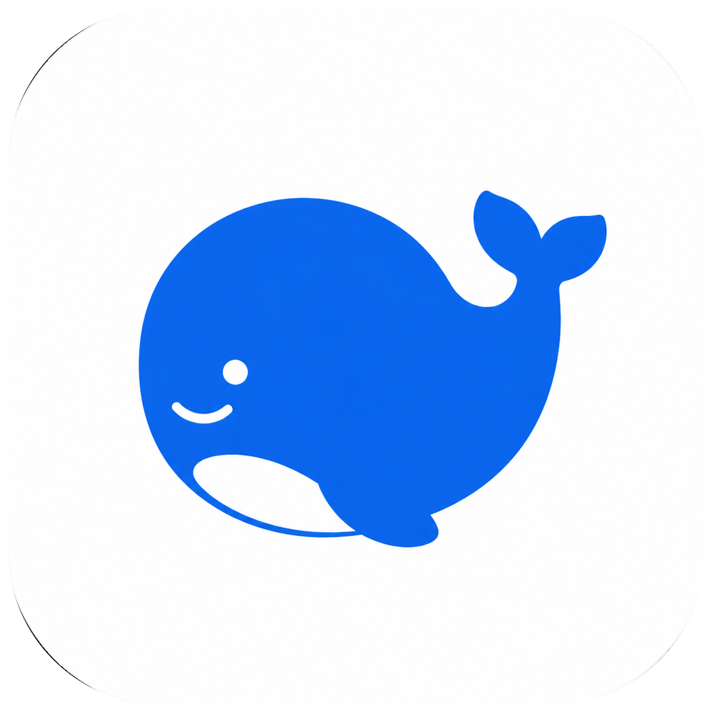

<p align="center">
  <a href="https://github.com/FlyXingByte/deepseek-harness-macos/releases/download/v2.3/DeepSeek-Harness-v2.3-macOS-arm64.dmg">
    
  </a>
</p>

<h1 align="center">DeepSeek Harness for macOS</h1>

<p align="center">把官方 DeepSeek Harness 放进一个真正属于程序坞的原生 macOS 窗口。</p>

<p align="center"><strong>非官方启动器 · Apple Silicon · macOS 12+</strong></p>

<p align="center">
  <a href="https://github.com/FlyXingByte/deepseek-harness-macos/releases/download/v2.3/DeepSeek-Harness-v2.3-macOS-arm64.dmg"><strong>↓ 下载 v2.3 DMG</strong></a>
  · <a href="https://github.com/FlyXingByte/deepseek-harness-macos/releases/download/v2.3/DeepSeek-Harness-v2.3-macOS-arm64.dmg.sha256">SHA-256</a>
  · <a href="https://github.com/FlyXingByte/deepseek-harness-macos/releases/tag/v2.3">版本说明</a>
  · <a href="https://github.com/deepseek-ai/deepseek-harness">官方 Harness ↗</a>
</p>

> [!WARNING]
> v2.3 尚未经过 Apple Developer ID 公证。macOS 可能阻止普通双击；首次启动请在访达中右键 App → **打开** → 再确认一次。不要关闭 Gatekeeper。

## 下载

### [↓ 下载 DeepSeek Harness v2.3 for macOS](https://github.com/FlyXingByte/deepseek-harness-macos/releases/download/v2.3/DeepSeek-Harness-v2.3-macOS-arm64.dmg)

| 项目 | 说明 |
|---|---|
| 安装包 | `DeepSeek-Harness-v2.3-macOS-arm64.dmg`，约 1.6 MB |
| 支持设备 | Apple Silicon Mac（M1 / M2 / M3 / M4 及后续芯片） |
| 系统要求 | macOS 12 或更高版本 |
| 运行依赖 | [Node.js 22.19+ 或 24+](https://nodejs.org/en/download)，系统中需要可用的 `npx` |
| 完整页面 | [v2.3 Release 与版本说明](https://github.com/FlyXingByte/deepseek-harness-macos/releases/tag/v2.3) |

下载旁边的 [SHA-256 文件](https://github.com/FlyXingByte/deepseek-harness-macos/releases/download/v2.3/DeepSeek-Harness-v2.3-macOS-arm64.dmg.sha256) 后，可以在终端验证：

```sh
cd ~/Downloads
shasum -a 256 -c DeepSeek-Harness-v2.3-macOS-arm64.dmg.sha256
```

看到 `DeepSeek-Harness-v2.3-macOS-arm64.dmg: OK` 即表示文件校验通过。

## 它是什么

这不是一个普通网页书签。它是一个轻量的原生 macOS 启动器：从程序坞打开独立窗口，启动固定版本的官方 `@deepseek-ai/dsh`，并在 WKWebView 中显示本机 Harness 工作台。

- **像普通 App 一样打开**：拥有独立窗口、菜单栏和程序坞图标。
- **只连接本机服务**：默认地址为 `http://127.0.0.1:3080`，不会把预览服务开放到局域网。
- **工作区由你决定**：使用隔离的默认目录，也可以切换到自己的项目文件夹。

## 三步安装

1. 下载 DMG，打开后把 **DeepSeek Harness.app** 拖入 **Applications**。
2. 在访达的“应用程序”中右键 App，选择 **打开**，然后在 macOS 提示中再次确认。
3. 首次启动时确认通过 `npx` 获取固定版本的官方 `@deepseek-ai/dsh@0.1.0-rc.6`，等待工作台出现。

首次获取 Harness 需要联网。启动器不会把 Node.js 或 Harness 本体塞进 DMG，因此请先安装官方 [Node.js](https://nodejs.org/en/download)。

## 第一次使用

1. 打开右上角 **Settings → Models**。
2. 在 DeepSeek 卡片中输入从 [DeepSeek API 开放平台](https://platform.deepseek.com/) 获取的 API Key，然后保存。凭据由官方 Harness 管理，启动器自身不存储它。
3. 从模型选择器中选择已经配置好的模型。
4. 点击 **Choose workspace**，选择一个独立的项目文件夹；没有工作区时，输入框会保持不可用。
5. 新建会话，先选择合适的权限，再输入任务。

建议从小任务开始，例如：

```text
只读分析这个项目。告诉我它解决什么问题、主要文件在哪里，以及下一步最值得做的三件事。不要修改文件。
```

常用权限选择：

| 权限 | 适合场景 |
|---|---|
| **Read Only** | 阅读、总结、审查，不修改文件 |
| **Workspace Write** | 普通开发、修改文件和运行项目内命令 |
| **Full access** | 仅在明确需要超出工作区时使用，并逐项确认风险 |

## 首次启动会发生什么


| 组件 | 谁提供 | DMG 是否包含 | 作用 |
|---|---|---:|---|
| macOS Launcher | FlyX 独立制作 | 是 | 窗口、程序坞图标、工作区选择与启动管理 |
| [DeepSeek Harness](https://github.com/deepseek-ai/deepseek-harness) | DeepSeek 官方 | 否 | Agent、Web UI、模型和工具运行时 |
| [Node.js](https://nodejs.org/) | Node.js 官方项目 | 否 | 运行 `npx` 和 Harness |

## DeepSeek 官方入口

- [DeepSeek 官方网站](https://www.deepseek.com/)
- [DeepSeek Harness 官方页面](https://deepseek.com/harness/)
- [DeepSeek 网页版对话](https://chat.deepseek.com/)
- [DeepSeek API 开放平台](https://platform.deepseek.com/)
- [DeepSeek Harness 官方 GitHub](https://github.com/deepseek-ai/deepseek-harness)

## Harness 官方操作指南

以下资料均来自 DeepSeek Harness 官方页面或 `deepseek-ai/deepseek-harness` 官方仓库：

| 官方资料 | 什么时候看 |
|---|---|
| [中文快速启动](https://github.com/deepseek-ai/deepseek-harness/blob/master/README.zh.md) | 查看官方 `npx @deepseek-ai/dsh web` 启动方式 |
| [官方文档主页](https://deepseek-harness.github.io/deepseek-harness/) | 浏览完整的 Harness 中文文档 |
| [Web UI 快速指南](https://deepseek-harness.github.io/deepseek-harness/guide/quickstart) | 配置模型、选择工作区并开始第一个任务 |
| [模型与 Provider 配置](https://deepseek-harness.github.io/deepseek-harness/guide/providers) | 配置 DeepSeek、其他 Provider 或自定义兼容服务 |
| [权限预设说明](https://deepseek-harness.github.io/deepseek-harness/reference/subsystems/permission-presets) | 理解权限选择器、沙箱模式与审批策略 |
| [CLI 模式说明（中文）](https://github.com/deepseek-ai/deepseek-harness/blob/master/apps/cli/README.zh.md) | 了解 Web、Headless、Profile 和插件管理 |
| [CLI 精确行为参考（中文）](https://github.com/deepseek-ai/deepseek-harness/blob/master/apps/cli/reference/README.zh.md) | 查看参数优先级、配置覆盖与退出行为 |
| [官方 Discussions](https://github.com/deepseek-ai/deepseek-harness/discussions) | 反馈 Harness 上游问题或参与社区讨论 |

> [!NOTE]
> DeepSeek Harness 当前仍处于 **Developer Preview**，可能出现破坏兼容性的变化。本启动器固定使用已验证的 `0.1.0-rc.6`，不会静默切换版本。

## 工作区、安全与隐私

- 默认工作区：`~/Documents/DeepSeek Harness Workspace`。
- 可从 App 菜单选择 **选择 Harness 工作区…**；服务已启动时，重启后新目录才会生效。
- 外接硬盘建议使用 APFS。exFAT 缺少 Harness 某些受保护写入所需的文件系统能力，可能出现 `ENOTSUP`。
- 模型凭据在 Harness 的 **Settings → Models** 中配置；启动器自身不保存、迁移或主动上传 API Key。
- 启动日志位于 `~/Library/Logs/DeepSeek Harness/harness-web.log`，不会打包进 App 或仓库。
- 外部 HTTP/HTTPS 链接交给默认浏览器；未知自定义协议会被阻止。
- 插件、MCP 和其他第三方组件可能执行外部代码，安装前请单独审查来源与权限。

官方安全参考：[权限预设](https://deepseek-harness.github.io/deepseek-harness/reference/subsystems/permission-presets) · [沙箱边界](https://deepseek-harness.github.io/deepseek-harness/reference/subsystems/sandbox) · [操作审批](https://deepseek-harness.github.io/deepseek-harness/reference/subsystems/approval) · [凭据管理](https://deepseek-harness.github.io/deepseek-harness/reference/subsystems/credentials) · [本地 Web Server](https://deepseek-harness.github.io/deepseek-harness/reference/subsystems/web-server)

## 常见问题

<details>
<summary><strong>macOS 提示无法验证开发者</strong></summary>

当前 v2.3 是未公证的公开测试版。请在访达中右键 App → **打开** → 再确认一次。不要使用命令关闭 Gatekeeper。

</details>

<details>
<summary><strong>提示找不到 Node.js 或 npx</strong></summary>

从 [Node.js 官方下载页](https://nodejs.org/en/download) 安装 Node.js 22.19+ 或 24+，关闭并重新打开 App。

</details>

<details>
<summary><strong>输入框不可用，无法发送任务</strong></summary>

先在 **Settings → Models** 配置并选择模型，再点击 **Choose workspace** 选择工作区。

</details>

<details>
<summary><strong>这是 DeepSeek 官方 macOS 客户端吗？</strong></summary>

不是。这是 FlyX 独立制作的非官方兼容启动器，与 DeepSeek 无隶属、赞助或官方背书关系。原创胖鲸图标也不是 DeepSeek 官方 Logo。

</details>

## 给开发者

<details>
<summary><strong>本地构建与验证</strong></summary>

```sh
./scripts/build.sh
./scripts/create-dmg.sh
./scripts/verify-release.sh
```

构建产物位于 `dist/`。脚本只进行 ad-hoc hardened runtime 签名；面向普通用户的无警告分发仍需要 Developer ID Application 证书和 Apple notarization。

</details>

## 版本与许可证

- macOS 启动器：`2.3`（Build 7）
- 默认 Harness 包：`@deepseek-ai/dsh@0.1.0-rc.6`
- 架构：`arm64`
- 本启动器：[MIT License](LICENSE)
- 上游 Harness：[DeepSeek Harness MIT License](LICENSES/DeepSeek-Harness-MIT.txt)
- 非官方与归属说明：[NOTICE.md](NOTICE.md)

启动器问题请提交到本仓库的 [Issues](https://github.com/FlyXingByte/deepseek-harness-macos/issues)。Harness 本身的问题请优先查看 [上游项目](https://github.com/deepseek-ai/deepseek-harness) 与 [官方 Discussions](https://github.com/deepseek-ai/deepseek-harness/discussions)。

---

<p align="center">这是一个独立制作的非官方项目。DeepSeek / DeepSeek Harness 仅用于说明兼容对象。</p>
