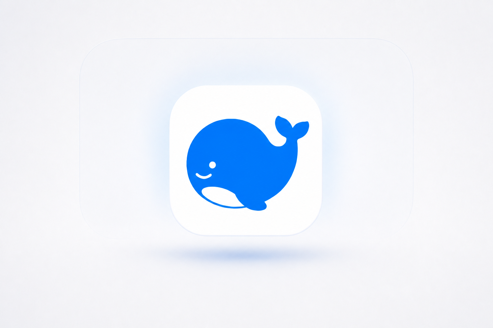

<h1 align="center">DeepSeek Harness for macOS</h1>

<p align="center"><strong>让官方 DeepSeek Harness，真正住进程序坞。</strong></p>
<p align="center">非官方启动器 · 独立窗口 · 本机工作区</p>

<p align="center">
  <a href="https://github.com/FlyXingByte/deepseek-harness-macos/releases/download/v2.5.0/DeepSeek-Harness-v2.5.0-macOS-arm64.dmg"><strong>↓ 下载 v2.5.0</strong></a>
</p>
<p align="center">
  <a href="./INSTALL.md">安装说明</a>
  · <a href="https://github.com/deepseek-ai/deepseek-harness">官方 Harness ↗</a>
</p>

<p align="center">Apple Silicon · macOS 12+ · Node.js 22.19–22.x 或 24.0+（不支持 23.x）</p>

> [!WARNING]
> **v2.5.0 尚未公证。** 首次打开：在访达中右键 App → **打开** → 再确认；不要关闭 Gatekeeper。

<p align="center">
  <picture>
    <source media="(prefers-color-scheme: dark)" srcset="./Assets/DeepSeekHarnessHeroDark.png">
    <source media="(prefers-color-scheme: light)" srcset="./Assets/DeepSeekHarnessHeroLight.png">
    
  </picture>
</p>

## 一个窗口。不是一个浏览器标签。

这是一个轻量的原生 macOS 启动器。它默认启动经过验证的官方 DeepSeek Harness 版本，也可以在你确认后选择 npm 官方发布的新版，并把工作台显示在独立窗口中。

- **从程序坞打开**：独立窗口、菜单栏和 App 图标。
- **原生窗口交互**：拖动标题栏移动窗口；`Command +` / `Command -` 调整字体，`Command 0` 恢复默认大小。
- **没有浏览器痕迹**：标题栏与工作台背景融为一体并跟随明暗主题；右键只保留原生编辑命令，控件不再出现网页手型光标与文字选中，整页橡皮筋回弹和网页滚动条也一并去掉。
- **一键检查内核更新**：从 App 菜单读取 npm 官方 `latest` / `next`，自动选择更高版本，并保留内置版本作为回退。
- **服务留在本机**：Harness Web UI 仅监听 `127.0.0.1:3080`。
- **工作区由你选择**：使用隔离的默认目录，或切换到自己的项目文件夹。

## v2.5.0 重点更新：像 App 一样打开，不再弹出 Safari

Harness 的工作台本质仍由官方 Web UI 提供，macOS 启动器继续使用 `WKWebView` 承载它。v2.5.0 改进的是呈现和启动方式：保留 Web UI 的完整能力，同时去掉会让独立窗口看起来像浏览器标签页的交互痕迹。

- 标准 macOS 标题栏与工作台背景融为一体，并跟随页面的明暗主题。
- 控件使用普通箭头光标，导航与按钮文字不再被误选；输入框和编辑区仍保留文本光标与原生复制粘贴。
- 右键菜单只保留剪切、复制、粘贴、撤销、重做等编辑命令，不再显示重新载入、后退、前进或检查元素。
- 关闭整页橡皮筋回弹、链接预览和资源拖拽，并让滚动条更接近 macOS 的轻量样式。
- 启动官方 Harness 时加入 `--no-open`，因此从程序坞打开 App 不会再自动弹出同一个 `127.0.0.1:3080` Safari 页面；真正的外部链接仍交给默认浏览器。

## v2.4.0 重点更新：Harness 内核可以自己跟进官方版本

以前，启动器和 Harness 内核版本绑定在一起：即使 DeepSeek 官方已经发布新内核，也要等启动器重新打包。v2.4.0 把这两件事拆开了——macOS App 继续提供稳定的原生窗口，Harness 内核则可以由你主动检查并切换。

打开 macOS 屏幕顶部的 **DeepSeek Harness** 菜单，你会看到：

- **Harness 内核：0.1.0-rc.6**：显示当前选择的内核版本。
- **检查并更新 Harness 内核…**：一键读取 npm 官方 `latest` 与 `next`，通过 SemVer 自动选择更高版本。
- **恢复内置内核 0.1.0-rc.6**：新版出现兼容问题时，可以直接回退到随 App 验证过的默认版本。

更新过程保留了一道人为确认：发现新版后，App 会先显示当前版本和目标版本，只有点击 **更新并重启** 才会切换。这不是后台静默升级，因为 Harness 仍处于 Developer Preview，新版本可能包含破坏兼容性的变化。

安全边界也没有扩大：

- 更新信息只来自固定的 npm 官方 dist-tags 地址，异常或不合法的版本号会被拒绝。
- App 只重启由它自己启动的 Harness 进程；如果 `127.0.0.1:3080` 是其他终端启动的服务，只保存新版选择，不会擅自结束外部进程。
- 更新只改变以后由 `npx` 获取的官方 `@deepseek-ai/dsh` 版本，不读取、迁移或修改 Harness 的 API Key、会话与工作区数据。

## 三步安装

1. [下载 v2.5.0 DMG](https://github.com/FlyXingByte/deepseek-harness-macos/releases/download/v2.5.0/DeepSeek-Harness-v2.5.0-macOS-arm64.dmg)，打开后把 **DeepSeek Harness.app** 拖入 **Applications**。
2. 在“应用程序”中右键 App，选择 **打开**，然后在 macOS 提示中再次确认。
3. 首次启动时确认通过 `npx` 获取默认版本的官方 `@deepseek-ai/dsh@0.1.0-rc.6`，等待工作台出现。

首次获取需要联网。请先从 [Node.js 官网](https://nodejs.org/en/download) 安装 Node.js；Harness 与 Node.js 均不包含在 DMG 中。

## 第一次使用

1. 打开右上角 **Settings → Models**，配置 Provider 与 API Key。
2. 保存设置，并在模型选择器中选中刚配置的模型。
3. 点击 **Choose workspace**，选择一个独立的项目文件夹。
4. 新建会话，选择合适的权限，再输入任务。

[查看官方 Web UI 快速指南 ↗](https://deepseek-harness.github.io/deepseek-harness/guide/quickstart)

<details>
<summary><strong>开始第一个任务与权限建议</strong></summary>

建议先用 **Read Only** 做一个小任务：

```text
只读分析这个项目。告诉我它解决什么问题、主要文件在哪里，以及下一步最值得做的三件事。不要修改文件。
```

- **Read Only**：阅读、总结、审查，不修改文件。
- **Workspace Write**：普通开发、修改文件和运行项目内命令。
- **Full access**：仅在明确需要超出工作区时使用，并逐项确认风险。

</details>

## 边界很清楚

- **Launcher**：本仓库提供，包含在 DMG 中，负责窗口、程序坞图标和启动管理。
- **DeepSeek Harness**：由 DeepSeek 官方维护，不包含在 DMG 中；首次启动经你确认后获取。
- **Node.js**：由用户安装，用于运行 `npx` 与 Harness。

> [!NOTE]
> DeepSeek Harness 仍处于 **Developer Preview**，可能出现破坏兼容性的变化。本启动器内置默认版本 `@deepseek-ai/dsh@0.1.0-rc.6`；只有你主动选择“检查并更新 Harness 内核…”并确认后，才会切换到 npm 官方 `latest` / `next` 中更高的版本。内置版本始终可从菜单恢复。

这是 FlyX 独立制作的非官方启动器，与 DeepSeek 或 Apple Inc. 无隶属、赞助或背书关系。名称仅用于说明兼容性；鲸鱼图标与主视觉不是官方素材。

## 工作区与数据

- 默认工作区为 `~/Documents/DeepSeek Harness Workspace`；也可从 App 菜单切换。
- 模型凭据由官方 Harness 管理；启动器自身不存储或迁移 API Key。
- Web UI 只监听本机，但模型请求仍会发送给你配置的 Provider。
- 外接盘建议使用 APFS；exFAT 可能因受保护写入能力不足出现 `ENOTSUP`。
- 启动日志位于 `~/Library/Logs/DeepSeek Harness/harness-web.log`。

<details>
<summary><strong>安全细节与官方参考</strong></summary>

外部 HTTP/HTTPS 链接交给默认浏览器；未知自定义协议会被阻止。插件、MCP 和其他第三方组件可能执行外部代码，安装前请单独审查来源与权限。Harness 通过 Models 页面保存的 Key 位于 `$DSH_HOME/.credentials.yaml`，页面不会回显明文。

[权限预设](https://deepseek-harness.github.io/deepseek-harness/reference/subsystems/permission-presets) · [沙箱边界](https://deepseek-harness.github.io/deepseek-harness/reference/subsystems/sandbox) · [操作审批](https://deepseek-harness.github.io/deepseek-harness/reference/subsystems/approval) · [凭据管理](https://deepseek-harness.github.io/deepseek-harness/reference/subsystems/credentials) · [本地 Web Server](https://deepseek-harness.github.io/deepseek-harness/reference/subsystems/web-server) · [会话遥测](https://deepseek-harness.github.io/deepseek-harness/reference/subsystems/session-telemetry)

</details>

<details>
<summary><strong>更多 DeepSeek Harness 官方资料</strong></summary>

- [DeepSeek Harness 官方页面](https://deepseek.com/harness/)
- [官方 GitHub 仓库](https://github.com/deepseek-ai/deepseek-harness)
- [中文快速启动](https://github.com/deepseek-ai/deepseek-harness/blob/master/README.zh.md)
- [官方文档主页](https://deepseek-harness.github.io/deepseek-harness/)
- [模型与 Provider 配置](https://deepseek-harness.github.io/deepseek-harness/guide/providers)
- [权限预设说明](https://deepseek-harness.github.io/deepseek-harness/reference/subsystems/permission-presets)
- [CLI 模式说明（中文）](https://github.com/deepseek-ai/deepseek-harness/blob/master/apps/cli/README.zh.md)
- [CLI 精确行为参考（中文）](https://github.com/deepseek-ai/deepseek-harness/blob/master/apps/cli/reference/README.zh.md)

</details>

<details>
<summary><strong>常见问题</strong></summary>

**macOS 提示无法验证开发者？** 这是未公证的公开测试版。请在访达中右键 App → **打开** → 再确认；不要关闭 Gatekeeper。

**提示找不到 Node.js 或 npx？** 从 [Node.js 官网](https://nodejs.org/en/download) 安装 Node.js 22.19–22.x 或 24.0+（不支持 23.x），然后重新打开 App。

**输入框不可用？** 先在 **Settings → Models** 配置并选择模型，再点击 **Choose workspace** 选择工作区。

**怎样更新 Harness 内核？** 打开菜单栏中的 **DeepSeek Harness → 检查并更新 Harness 内核…**。若官方存在更高版本，启动器会自动选中并请求确认；若当前 3080 服务由其他终端启动，只保存选择，不会擅自终止外部进程。

</details>

<details>
<summary><strong>验证下载文件与本地构建</strong></summary>

下载 [SHA-256 文件](https://github.com/FlyXingByte/deepseek-harness-macos/releases/download/v2.5.0/DeepSeek-Harness-v2.5.0-macOS-arm64.dmg.sha256) 后，在终端运行：

```sh
cd ~/Downloads
shasum -a 256 -c DeepSeek-Harness-v2.5.0-macOS-arm64.dmg.sha256
```

本地构建与验证：

```sh
./scripts/build.sh
./scripts/create-dmg.sh
./scripts/verify-release.sh
```

脚本只进行 ad-hoc hardened runtime 签名；无警告分发仍需要 Developer ID Application 证书和 Apple notarization。

</details>

---

<p align="center"><sub><a href="https://github.com/FlyXingByte/deepseek-harness-macos/releases/tag/v2.5.0">v2.5.0</a> · DSH 0.1.0-rc.6 · arm64 · <a href="./LICENSE">MIT</a> · <a href="./NOTICE.md">NOTICE</a> · <a href="https://github.com/FlyXingByte/deepseek-harness-macos/issues">Issues</a></sub></p>
